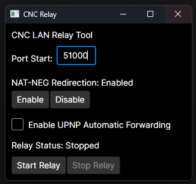

# Command and Conquer Red Alert 3 LAN Helper.

This program fixes the connection 1-2 issue that occurs within LANs clients while using CNC Online / Revora.  

Typical error that occurs with same player on the network between Players 1 and 2.  
>*Connections are in progress, or connection problem detected. Please wait for the connection to finish, or kick the player who has the connection problem.  
Connection in progress: 1-2*  

## This problem:
A limitation in most Router NAT services doesn't allow connections from within the network to access the public side port opened by other devices.
The NAT Negotiation server provides the public internet address to other clients, which due to the limitation doesn't allow clients on the same network to reach each other.

## The fix:
Route traffic directly to lan clients.
This program acts as a proxy that relays the traffic from the random source ports to a range of known ports starting from a number you can specify in this tool.
A lan discovery process will detect other clients and update the address provided from CNC Online servers to the local address.

## Instructions:  
1. Download the tool(available from releases on the right).  
2. Run the tool as administrator (Admin Rights are only required for the Host Redirection setting change, not required for normal usage).  
3. Click Enable on NAT-NEG Redirection.  
**(This will redirect NAT Negotiation traffic to the local machine and persists even if the app is closed)**  
4. Select a starting port range number or use the random one provided.  
(The port range must be unique per machine within your network).  
5. Click Start Relay.  
6. If you have any Windows Firewall prompts, click allow as it uses a listening port for inbound network traffic.  
7. Play RA3 Online.  

Image the tool interface:  
  

**Port Forwarding Note:**  
Port forwarding is no longer required to provide internal lan-to-lan traffic.
The system may have issues if your local nat router uses port randomisation as the ports detected by the cnc online nat negotiation server will not be the same.
You can try using the alt peer mode to resolve this issue (all clients must use matching setting).

UPNP will try to automatically open required ports if available on your router for forwarding external traffic but it's not normally required.

**Notes & Limitations**
- Dropout / Disconnection handling does not work if you stop the relay and resume it will cause player dropout.
- Co-Op Campaign is supported Relay has been tested and does resolve same issue for campaign co-op.
- The connection attempt between players only occurs for a short period of time when the player joins the match. The game indicates it is retrying to connect to players in the chat but it isn't, connection attempts will stop after the first minute.
- Port randomisation if enabled on your router's NAT system can cause problems.
- Tested with Mikrotik RouterOS as the local gateway.

**Command Line Version**  
For a command line version of the program that includes console logging information, use the CncLocalRelay.exe
The only parameter required is the starting port range eg: CnCLocalRelay.exe 51000

**Linux Support Notes**
The app runs on linux however has not been tested.  
Extract the tar.gz file and run the CncLocalRelayUI file.  

**Dont want to run as administratoror sudo**
You can manually update your host file entry, it just needs this line added:  
`127.0.0.1 natneg.server.cnc-online.net`
On Windows it's at C:\Windows\System32\Drivers\etc\hosts
On Linux it's at /etc/hosts